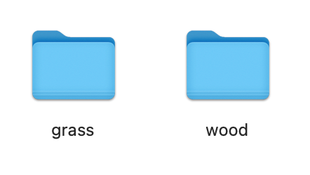
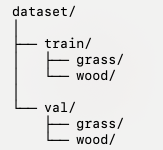

# Classify-wood-and-grass-using-ResNet18
## The **demo_ResNet_ImageClassification.ipynb** shows following process:  
**1. Create train and test data.**

Our source data consists of 50 grass images and 50 wood images downloaded from the internet. Due to size limitations, we are unable to upload them to the repository. Initially, it should look like this:

    

 We created a directory called dataset and randomly selected 70% of the grass and wood images to be the training data, while 30% were allocated for the testing data. After this process, our folder should have the following structure:

    

Inside train/grass, train/wood, val/grass, and val/wood we performed data augmentation

**2. Load ResNet18 model and fine tune it on our dataset**  
We use the code from the following tutorial to train and test our model:  
https://github.com/AarohiSingla/Image-Classification-Using-Pytorch/blob/main/README.md  
We locked all layers except for the output layer of the ResNet18 model. We only fine-tuned the model on its last layer to adapt it for our wood and grass classification task. Since our dataset is even smaller than the one used in this tutorial, we further reduced the number of epochs to 5.

**3. Test the model on a new image**  
The testing process also follows the aboved tutorial. We use a grass image to test the result.

## app.py
Here is the link of our gradio interface:  
https://huggingface.co/spaces/SiyunHE/ResNet18_WoodGrass_Classification  
**1. app**  
This interface is based on our trained model. Users can upload wood or grass images to the image upload window and get the classification result: "wood" or "grass" in the output window.  
**2. files**  
In the link above, under the file folder, we uploaded our trained model. Due to the space limitations of GitHub, we are unable to upload the trained model. However, you can download it from our Hugging Face space.

## References
[1] YouTube, https://www.youtube.com/watch?v=mn5QDKQ54dQ&t=975s (accessed Oct. 16, 2024).  
[2] AarohiSingla, “Image-classification-using-pytorch/image_classification.ipynb at main · AAROHISINGLA/image-classification-using-pytorch,” GitHub, https://github.com/AarohiSingla/Image-Classification-Using-Pytorch/blob/main/image_classification.ipynb (accessed Oct. 16, 2024). 